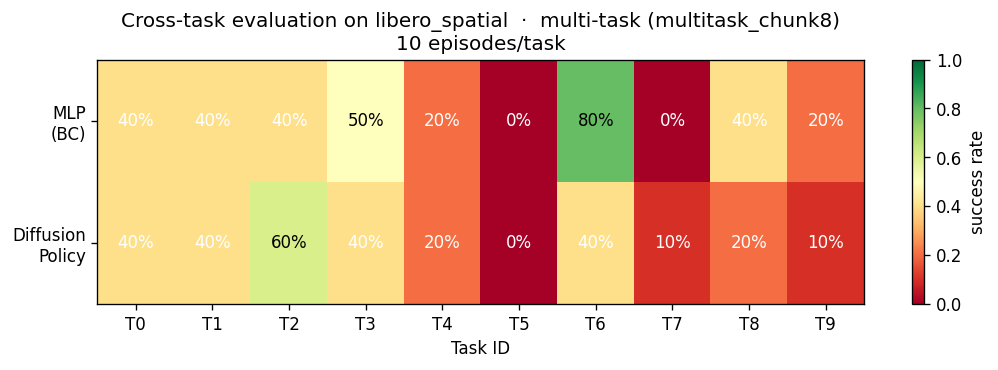
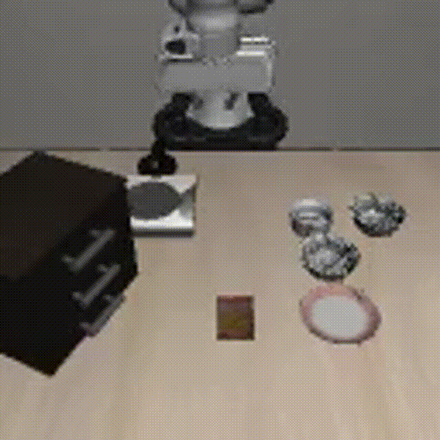
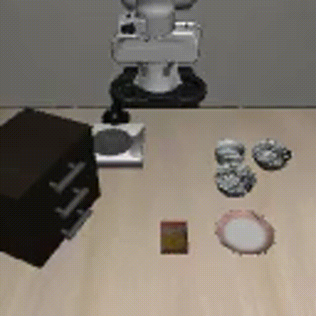
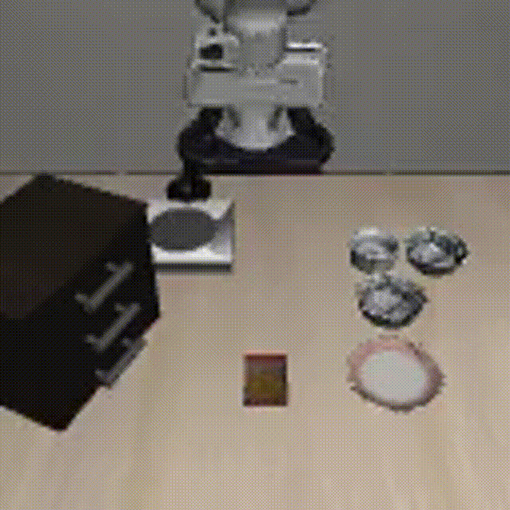

# LIBERO-Spatial: BC vs Diffusion Policy under Resource Constraints

[English](README.md) | [简体中文](README.zh-CN.md)

> An empirical study on when simple Behavioral Cloning beats Diffusion Policy
> in robot manipulation imitation learning, conducted on a single 8GB laptop GPU.



## TL;DR

Trained ResNet18-based **MLP BC** (11M params) and **Diffusion Policy** (15M params, 1D Conv-UNet + EMA + DDIM)
on LIBERO-Spatial (10 tasks × 50 demos = 500 trajectories), evaluated cross-task on 100 episodes per setting.
Three ablations show the **BC vs DP winner depends on observation richness**:

| Setting | MLP BC | Diffusion Policy | Winner |
|---|---|---|---|
| Single view (agentview), `chunk_steps=1` | **33%** | 17% | BC +16 |
| Single view, `chunk_steps=8` (DP paper default) | **33%** | 28% | BC +5 |
| **Dual view (+ wrist cam), `chunk_steps=8`** | 21% | **32%** | **DP +11** |

**Empirical findings**:
1. **DP is highly hyperparameter-sensitive**: success rate jumps 17% → 32% just from tuning `chunk_steps` and adding wrist camera, while keeping the model and training data fixed.
2. **Adding wrist camera *hurts* MLP** (33% → 21%) despite reducing test MSE by 32% (0.0226 → 0.0154). A textbook example of **action regression loss ≠ task success** in imitation learning.
3. The "BC vs DP" debate is **setting-dependent**: under low-information observations, simple deterministic regression is more robust; richer observations let DP's multi-modal generation shine.

## Demo GIFs

Representative rollouts from the benchmark. The first row shows MLP, the second row shows DP.

| MLP success | MLP failure |
|---|---|
|  |  |

| DP success | DP failure |
|---|---|
|  |  |

## Why this is interesting

Most papers compare BC vs DP under *one* setting (the paper's own). This project shows that **the same architectures can flip winners** by changing two knobs (chunk size + camera). Useful when deciding whether to deploy DP in resource-constrained / single-camera robots.

## Repository structure

```
Project_A/
├── README.md
├── .gitignore
└── libero-bc-vs-dp-study/
├── 02_dataset.py                       # LIBERO HDF5 loader + multi-task ConcatDataset
├── 03_train_mlp.ipynb                  # Single-task MLP training (legacy)
├── 04_eval.py                          # Rollout evaluation (auto-detects MLP / MLP+wrist / DP)
├── 05_diffusion_policy.py              # Diffusion Policy: 1D Conv-UNet + DDIM + EMA
├── 06_train_diffusion.ipynb            # Single-task DP training (legacy)
├── 07_diagnose.py                      # DP failure-mode analysis (action drift, gripper)
├── 08_task_generalization.py           # Cross-task evaluation entry point
├── 09_train_mlp_multitask.py           # Multi-task MLP, single view
├── 09b_train_mlp_multitask_wrist.py    # Multi-task MLP, dual view (wrist ablation)
├── 10_train_diffusion_multitask.py     # Multi-task Diffusion Policy
└── outputs/                            # Trained models, eval JSONs, heatmaps
```

## Reproducing the results

### Setup

```bash
# WSL2 + Ubuntu, install LIBERO into a conda env
conda create -n libero python=3.10
conda activate libero
cd libero-bc-vs-dp-study/LIBERO && pip install -e . && cd ../..
# PyTorch 2.3.1+cu121, diffusers, h5py, etc.
```

Dataset (LIBERO-Spatial, 10 hdf5 files) auto-located via `libero.libero.get_libero_path("datasets")`.

### Training

```bash
# run from Project_A/
cd libero-bc-vs-dp-study

# Multi-task MLP, single view (~22 min on RTX 3070 Ti 8GB)
python 09_train_mlp_multitask.py

# Multi-task MLP, dual view (wrist ablation) (~22 min)
python 09b_train_mlp_multitask_wrist.py

# Multi-task Diffusion Policy (~70 min, 15 epochs)
python 10_train_diffusion_multitask.py
```

All training scripts pre-load demos into RAM (`cache_in_ram=True`), giving ~70× speedup over disk I/O.

### Evaluation

```bash
# run from Project_A/libero-bc-vs-dp-study/

# Single view, DP paper-default chunk_steps=8
python 08_task_generalization.py \
    --mlp outputs/model_mlp_multitask.pt \
    --dp  outputs/model_diffusion_multitask.pt \
    --tag multitask_chunk8 --chunk-steps 8 --episodes 10

# Dual view ablation (auto-detects wrist MLP from checkpoint)
python 08_task_generalization.py \
    --mlp outputs/model_mlp_multitask_wrist.pt \
    --dp  outputs/model_diffusion_multitask.pt \
    --tag multitask_wrist --chunk-steps 8 --episodes 10
```

Each command runs 10 tasks × 10 episodes × 2 models ≈ 90 min and writes a JSON summary + heatmap PNG to `outputs/`.

## Key implementation notes

- **`cache_in_ram=True`** in [libero-bc-vs-dp-study/02_dataset.py](libero-bc-vs-dp-study/02_dataset.py): pre-loads all 500 demos into RAM at dataset construction time. Without it, training is bottlenecked at ~3.7s/iter (HDF5 random access); with it, ~0.05s/iter.
- **DP receding-horizon `chunk_steps`** in [libero-bc-vs-dp-study/04_eval.py](libero-bc-vs-dp-study/04_eval.py): predict 16-step action sequence, execute first `K`, then re-sample. K=1 (per-step resample) breaks the trajectory smoothness DP learned; K=8 (paper default) preserves it.
- **Wrist camera as 6-channel input** in [libero-bc-vs-dp-study/09b_train_mlp_multitask_wrist.py](libero-bc-vs-dp-study/09b_train_mlp_multitask_wrist.py): concatenate `agentview_rgb` + `eye_in_hand_rgb` along channel dim; reinitialize ResNet18's first conv for 6→64 channels.
- **EMA + DDIM** for DP (decay 0.995, 100 train steps, 10 inference steps): standard tricks from the original Diffusion Policy paper.

## What this project did NOT explore

- Language-conditioned policies (CLIP / T5 instruction encoders)
- Larger backbones (ViT, R3M) — limited by 8GB VRAM
- Real-world transfer
- Other LIBERO suites (Goal / Object / 100)

## Limitations

- Each cell in the comparison table is **10 episodes** → ±15% noise floor; differences <5% should not be over-interpreted.
- Diffusion Policy was trained for 15 epochs (vs MLP's 30) due to time budget; longer DP training might further close the gap.
- Single seed for everything; no error bars.

## Acknowledgments

Built on top of the [LIBERO benchmark](https://libero-project.github.io/) and the [Diffusion Policy](https://diffusion-policy.cs.columbia.edu/) reference implementation.
Internal working notes are kept private and are not included in this repository.
